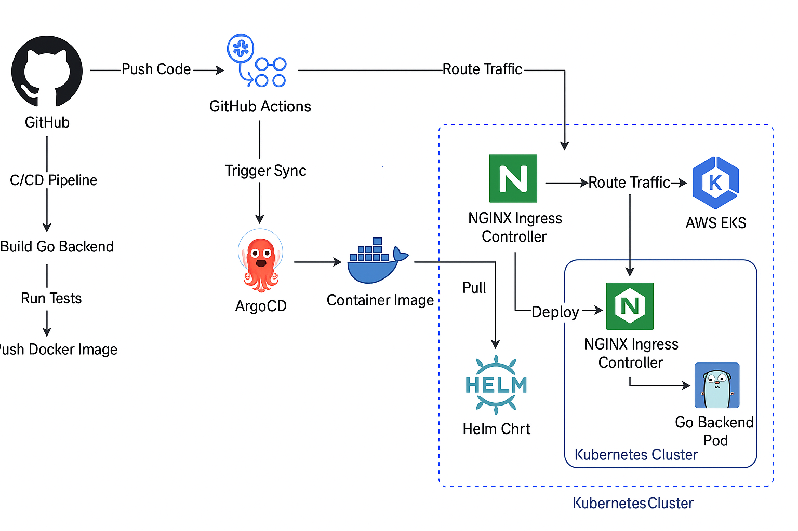

# joshnspire-web-app

A production-grade cloud-native web application demonstrating end-to-end DevOps practices including CI/CD with GitHub Actions, GitOps with ArgoCD, container orchestration on AWS EKS, and packaging with Helm.

---

##  Project Overview

**joshnspire-web-app** is a modern micro web app built using GoLang for backend and HTML for frontend. It showcases a real-world DevOps pipeline and GitOps deployment strategy used in large-scale production environments.

### Key Highlights:
- Containerized Go backend + static HTML frontend
- CI/CD pipeline with **GitHub Actions**
- GitOps deployment with **ArgoCD**
- Helm chart packaging for Kubernetes
- Hosted on **AWS EKS** (Elastic Kubernetes Service)
- Ingress managed by **NGINX + AWS ALB**

---

##  Architecture



**Workflow Summary:**

1. Developer pushes code to GitHub.
2. GitHub Actions:
   - Runs tests and linters
   - Builds Docker image
   - Pushes image to registry
   - Updates Helm chart version
3. ArgoCD auto-syncs to EKS with new Helm values.
4. EKS schedules pods, and traffic is routed via ALB → NGINX Ingress → Go backend service.

---

##  Tech Stack

| Layer             | Technology                |
|------------------|---------------------------|
| Language          | Go                        |
| Frontend          | Static HTML               |
| Containerization  | Docker                    |
| Orchestration     | Kubernetes on AWS EKS     |
| CI/CD             | GitHub Actions            |
| GitOps            | ArgoCD                    |
| Package Manager   | Helm                      |
| Ingress Controller| NGINX + AWS ALB           |

---

##  Project Structure

```
.
├── static/                          # Static HTML frontend
├── main.go                          # Go backend server
├── main_test.go                     # Unit tests
├── Dockerfile                       # Build instructions
├── go.mod / go.sum                  # Go dependencies
├── helm/
│   └── joshnspire-web-app-chart/    # Helm chart to deploy app on Kubernetes
├── k8s/                             # Raw Kubernetes manifests (optional)
└── .github/workflows/               # GitHub Actions CI/CD pipeline
```

---

##  CI/CD Pipeline (GitHub Actions)

GitHub Actions workflow automates:
- Code linting & testing
- Docker build & image push
- Helm chart update

```yaml
# Sample GitHub Actions Step
- name: Build & Push Docker Image
  run: |
    docker build -t $IMAGE_TAG .
    echo $DOCKER_PASS | docker login -u $DOCKER_USER --password-stdin
    docker push $IMAGE_TAG
```

---

##  GitOps with ArgoCD

- ArgoCD monitors the Git repository for changes.
- Automatically syncs Helm values to the EKS cluster.
- Ensures declarative and version-controlled deployments.

---

##  Getting Started

### Prerequisites

- AWS CLI configured
- EKS cluster setup
- ArgoCD installed and accessible
- Docker Hub or ECR registry
- Docker, kubectl, Helm installed

### Deployment Steps

```bash
# Clone repo
git clone https://github.com/joshua1787/joshnspire-web-app.git
cd joshnspire-web-app

# Build image
docker build -t <your-image> .

# Push image
docker push <your-image>

# Deploy using Helm
cd helm/joshnspire-web-app-chart
helm upgrade --install joshnspire . --values values.yaml
```

---

##  Features

- End-to-end automated DevOps pipeline
- GitOps-first architecture
- Lightweight and scalable Go backend
- Easy to replicate and extend in real projects
- Suitable for production-ready workflows

---

##  License

--

---

## 👨‍💼 Author

**Joshua Veeraiah**  
AWS Certified DevOps Engineer – Professional  
GitHub: [@joshua1787](https://github.com/joshua1787)
```

---

